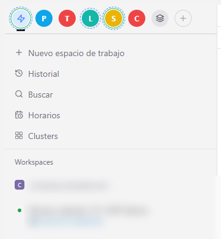

# paseo-plugin-clusters

*[English](README.md) · Español*

Plugin para [Paseo](https://paseo.sh) que agrupa tus proyectos en **clusters** y los pone como
círculos encima de la lista de workspaces, al estilo de los servidores de Discord.

## Instalación

```bash
paseo plugin install github:thisjrodriguez/paseo-plugin-clusters
```



## Qué hace

- **Círculos en la barra lateral.** Una fila encima de «Nuevo espacio de trabajo». Al pulsar un
  cluster, la lista nativa muestra solo sus proyectos.
- **⚡ Recientes.** Los proyectos usados recientemente (24 horas por defecto, ajustable de 1 a 48
  en la pantalla Clusters). Entran arriba la primera vez, después mantienen su sitio y los
  reordenas tú. Cuando pasa ese tiempo sin uso, desaparecen.
- **Ocultar de Recientes.** Pasa el ratón por un proyecto en Recientes y pulsa el ojo tachado junto
  a «+» y «⋯» para quitarlo de la lista hasta que se vuelva a usar.
- **Todos.** La lista completa, tal y como la muestra Paseo.
- **Anillos de estado.** Discontinuo cuando un workspace del cluster está trabajando, verde cuando
  alguno ha terminado y no lo has abierto.
- **Arrastrar y soltar.** Arrastra un proyecto hasta un círculo para moverlo a ese cluster, o
  arrástralo arriba y abajo para ordenarlo dentro del cluster. Los círculos también se reordenan.
- **Pantalla de gestión.** Crear clusters con nombre, icono (letra, emoji o símbolo) y color libre;
  mover proyectos entre clusters; buscador; y la pestaña Todos con los proyectos sin cluster.
- **Un proyecto, un cluster.** Los proyectos nuevos entran en el cluster que tengas seleccionado.
- **Cada daemon, sus clusters.** Los clusters se guardan en el daemon, así que son los mismos desde
  cualquier cliente conectado a ese equipo, y solo a ese. Con varios daemons conectados, la barra
  muestra los del que estás viendo y los cambios se escriben solo en ese daemon. La vista
  seleccionada es de cada cliente.

## Limitaciones

- Paseo **0.8.0** o superior.
- **Solo escritorio.** Los círculos se inyectan en la interfaz web de la app, así que en iOS y
  Android no aparecen. En el móvil funciona la pantalla Clusters, con tus clusters y sus workspaces.
- El plugin se apoya en los atributos `data-testid` de la barra lateral de Paseo. Son estables, pero
  una actualización de Paseo puede cambiarlos; si algo deja de verse, abre una incidencia.
- La interfaz está en español.

## Desarrollo

```bash
npm install
npm run typecheck
npm test
paseo plugin install /ruta/a/paseo-plugin-clusters
paseo plugin reload paseo-clusters   # tras cada cambio
paseo plugin logs paseo-clusters
```

| Archivo | Para qué |
| --- | --- |
| `index.client.tsx` | Registra la pantalla, el menú y arranca la barra y la sincronización |
| `client/web.ts` | Barra de círculos, filtro de la lista nativa y arrastres |
| `client/store.ts` | Estado de los clusters, uno por daemon conectado |
| `client/clusters.tsx` | Pantalla de gestión de clusters |
| `client/cluster-form.tsx` | Formulario de crear y editar |
| `index.server.ts`, `server/storage.ts` | Guarda los clusters en el daemon |

## Licencia

MIT
